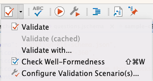
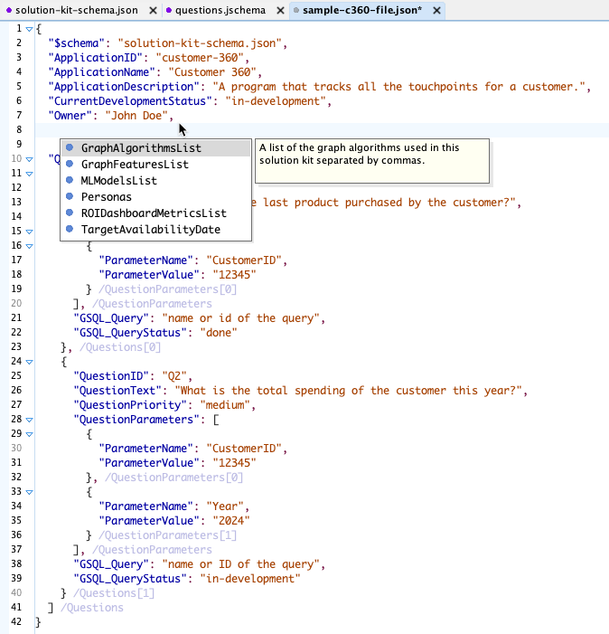

# JSON File Format

We use JSON to store our Solution Kit metadata.
We use JSON Schema to design and validate our solution kit metadata.
The JSON Schema is also used as an autocomplete tool within schema-aware text editors.

## JSON Schema Standards

### File Name Standards

Tools will look in the main directory of each solution kit for the following file name:

```solution-kit-metadata.json```

The name of the JSON schema to validate the file is called ```solution-kit-metadata.jschema```.
Note that the file extension ```.jschema``` is used although the file format is also JSON.

There should only be a single version of that ```solution-kit-metadata.json``` file in each solution kit.
If the solution kit is shipped to a customer, the build tool should include both the metadata file
and the schema file to a customer.

### Schema Name In JSON Instance

To validate your file and use the auto-suggest functions of your JSON editor, you can specify the schema name as the first property of your file:


```json
{
  "$schema": "solution-kit-schema.json",
  "ApplicationID": "customer-360",
  "ApplicationName": "Customer 360",
  "ApplicationDescription": "A program that tracks all the touchpoints for a customer.",
  "CurrentDevelopmentStatus": "in-development",
  "Owner": "John Doe"
}
```

### Binding a Schema to a JSON file within the oXygen JSON editor

We can also direct the oXygen JSON editor by using the "Red Check" icon on your toolbar:



### Using Auto-Complete

After you associate your JSON instance with the solution kit metadata schema you can enable
powerful validation and auto-complete features that suggest the next property or item.




## Required Fields

The following fields are required by a solution kit metadata file:

1. ApplicationID - This ID should match the directory name and be all lower-case and dashes.  Avoid duplicate ids.
2. ApplicationName - The name of the Solution Kit application such as "Customer 360".  You are encouraged to use title case and spaces.
3. ApplicationDescription - This is a full description of the application in a detailed paragraph format.
4. CurrentDevelopmentStatus - the status of the solution kit: 
4. Owner - the owner of the solution kit

### Schema Versioning Strategy

In the future, the schema may be versioned, and the version number may appear in the schema file name.  This implies that
all files that reference the schema might need to be updated, so it should be done with caution.

Note that if we ship a solution kit to the customer, the JSON Schema file should be included in the distribution.


