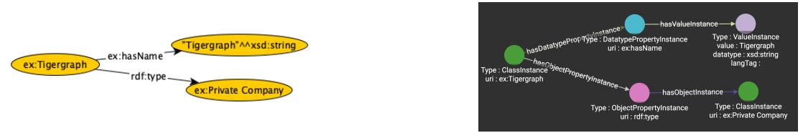

# CoPilot Metadata

CoPilot is a generative AI-powered framework of tools that help
you build conversational AI front-ends to TigerGraph.

This site provides resources so you can create the necessary
metadata to make your questions accurately map to functions
and documents.

For full documentation on CoPilot, you can go to
 the [TigerGraph CoPilot GitHub Repository](https://github.com/tigergraph/copilot).

 The CoPilot metadata architecture draws on many other standards including:

 1. SKOS
 2. SKOS-XL
 3. Dublin Core
 4. JSON
 5. JSON Schema

 Although we don't use RDF as an internal representation, we do
 support tools that convert RDF into our internal labeled-property graph
 data model.  
 
 
 
 The following paper describes this process:

 [RDF2TG: Towards Supporting RDF in TigerGraph
Property Graph Database System](https://ceur-ws.org/Vol-3254/paper400.pdf)

Note that the LPG allows attributes to be added to any relationship without reification.
This prevents us from having to rewrite queries as new relationship attributes are created.